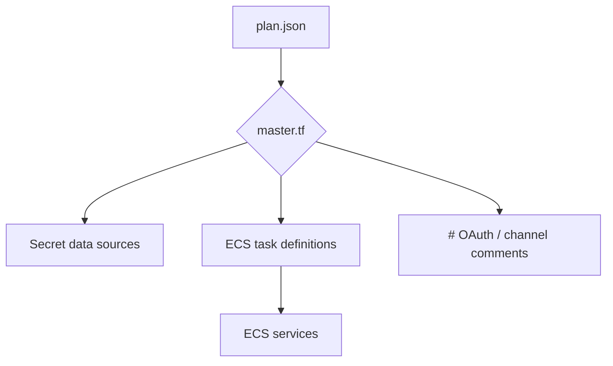
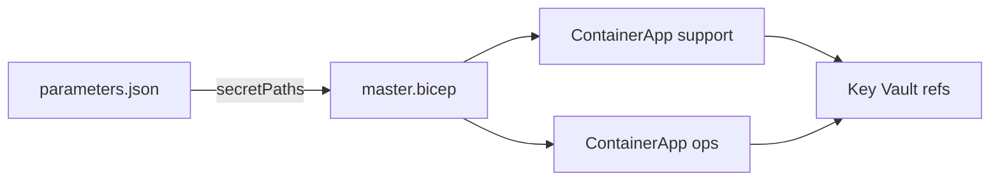
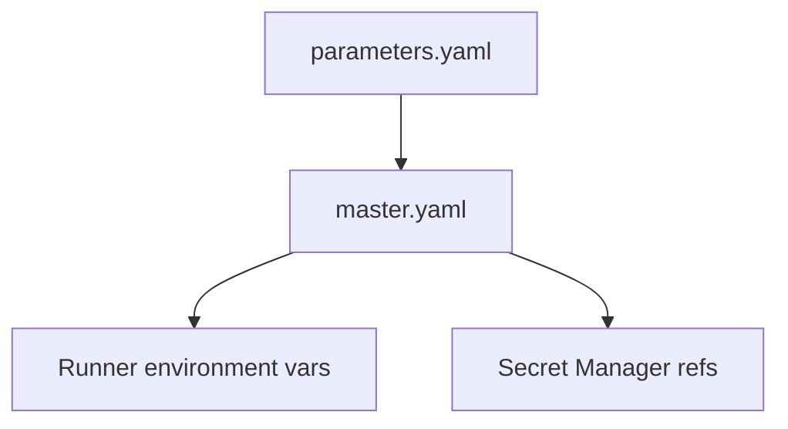
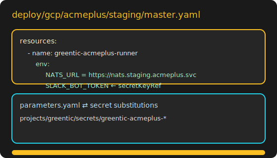

# Provider Artifact Visual Guide

Quick reference for reviewing the generated IaC artifacts per cloud provider. Use this when preparing screenshots or demos.

## Directory Layout

```text
deploy/
└── <provider>/<tenant>/<environment>/
    ├── master.tf|master.bicep|master.yaml
    ├── variables.tf|parameters.json|parameters.yaml
    ├── plan.json
    ├── apply-manifest.json
    └── destroy-manifest.json
```

## AWS (Terraform/OpenTofu)

- Open `master.tf` in any HCL viewer to highlight:
  - `aws_ecs_task_definition` / `aws_ecs_service` blocks per runner.
  - `data "aws_secretsmanager_secret_version"` entries for each logical secret.
- Diagram cheat sheet:



- Screenshot tip: fold everything except a single runner block plus the secret data sources.
- Mock reference: 

## Azure (Bicep)

- Load `master.bicep` in VS Code with the Bicep extension or the Azure portal editor to show tooltips.
- Useful anchors:
  - `param secretPaths object` demonstrates Key Vault wiring.
  - Each `Microsoft.Web/containerApps` resource references telemetry env vars and secrets.



- Screenshot tip: capture the outline panel plus the `secretPaths` hover tooltip.
- Mock reference: 

## GCP (Deployment Manager)

- `master.yaml` describes the deployment; `parameters.yaml` contains substitutions.
- Focus on the `env` entries that pull from Secret Manager via `valueFrom.secretKeyRef`.



- Screenshot tip: show the YAML `env:` block with the secret reference expanded.
- Mock reference: 

## Manifests

- `apply-manifest.json` / `destroy-manifest.json` are provider-agnostic summaries:
  - `secrets` → logical name, provider path, byte length.
  - `oauth_clients` → provider ids and redirect URLs.
- Paste them into a JSON viewer and highlight the sections above when walking through a plan/apply flow.
