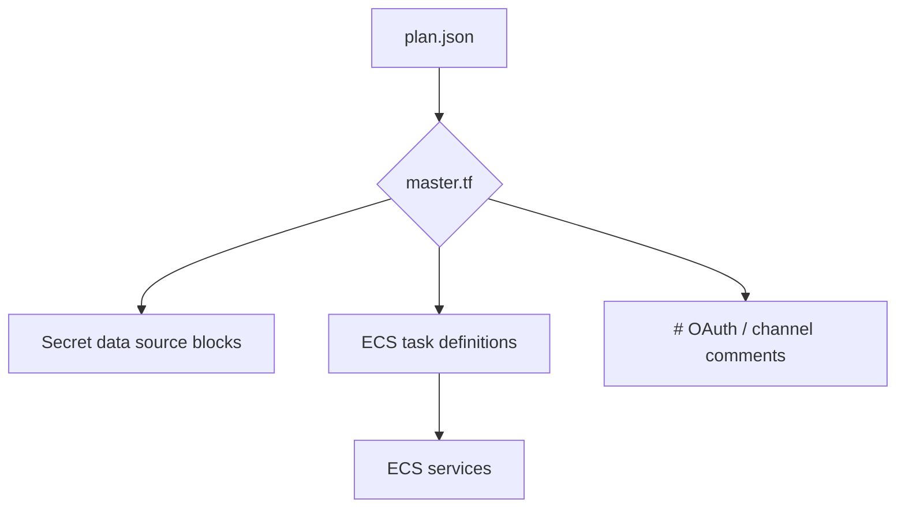
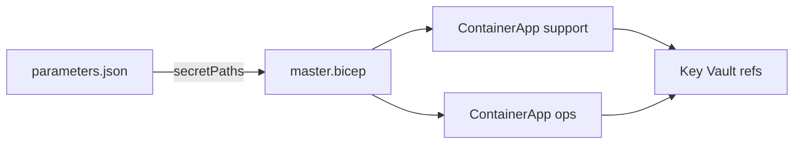
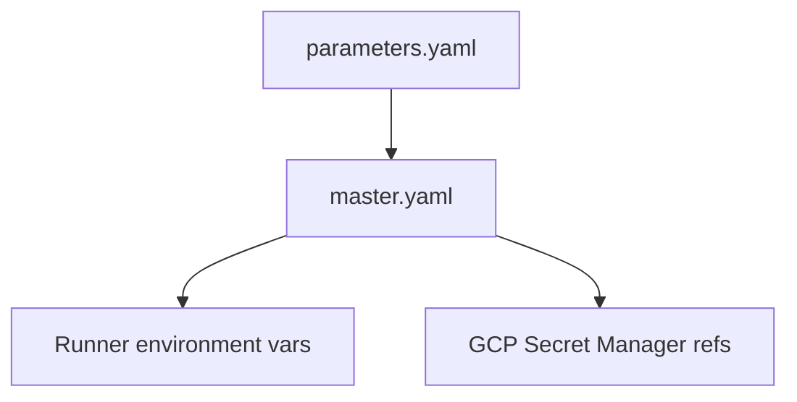

# Provider Artifact Visual Guide

This guide shows how to inspect the generated IaC for each provider and includes lightweight diagrams you can reference when presenting the artifacts.

## Directory Layout

```text
deploy/
└── <provider>/
    └── <tenant>/<environment>/
        ├── master.tf|master.bicep|master.yaml
        ├── variables.tf|parameters.json|parameters.yaml
        ├── plan.json
        ├── apply-manifest.json
        └── destroy-manifest.json
```

## AWS (Terraform/OpenTofu)

- Preview `master.tf` in any HCL viewer to highlight:
  - `aws_ecs_cluster`, `aws_ecs_task_definition`, and `aws_ecs_service` per runner.
  - `data "aws_secretsmanager_secret_version"` entries per logical secret.
- Use the following diagram when documenting reviews:



- To capture a screenshot:
  1. Open `deploy/aws/acmeplus/staging/master.tf` in VS Code.
  2. Fold everything except one runner block.
  3. Take a screenshot showing the secret data sources + ECS service.
- Mock reference:


## Azure (Bicep)

- Open `master.bicep` in the Azure Portal editor or VS Code with the Bicep extension to render intellisense-driven tooltips.
- The template exposes:
  - `param secretPaths object` for Key Vault references.
  - `resource Microsoft.Web/containerApps` sections per runner, each referencing the generated secrets and telemetry environment variables.



- Screenshot idea: capture the Bicep outline and the `secretPaths` parameter tooltip.
- Mock reference:


## GCP (Deployment Manager YAML)

- `master.yaml` renders deployment resources with inline secret references and telemetry annotations.
- `parameters.yaml` mirrors the substitution values; open both side-by-side in your editor to show the mapping.



- Screenshot idea: display the YAML `env:` block highlighting `valueFrom.secretKeyRef` entries.
- Mock reference:


## Manifests

- `apply-manifest.json` and `destroy-manifest.json` are consistent across providers. Use them to show:
  - Which logical secrets map to provider paths.
  - OAuth redirect URLs for manual registration.
- Suggested visualization: paste the manifest into a JSON viewer and highlight the `secrets` and `oauth_clients` arrays.
